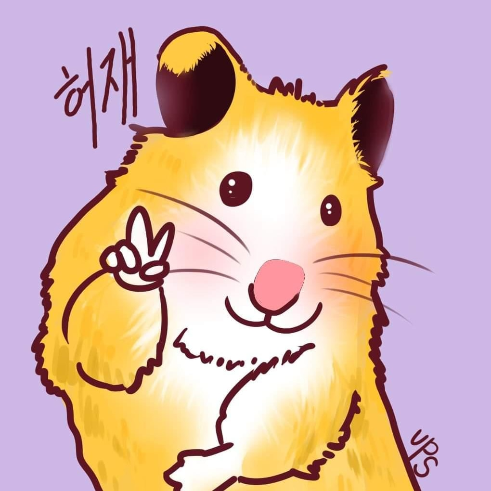

<div align="center">




```bash
$ whoami
> 허재 (heojae0281-source) — 자율주행을 만드는 개발자 🐹
$ cat interests.txt
> Autonomous Driving · Sensor Fusion
```

</div>

---

### 🧑‍💻 About Me

- 📡 **카메라 + 라이다 융합**으로 동적 장애물 정지 기능을 만들고 있어요
- 🏁 SEA:ME 해커톤 2026 참가
- 📫 Contact: **heojae0281@gmail.com**

---

### 🛠️ Tech Stack

<div align="center">

**Languages**<br/>


**Robotics & Autonomous Driving**<br/>


**Environment & Tools**<br/>


</div>

---

### 🐍 Contribution Snake

<div align="center">
<picture>
  <source media="(prefers-color-scheme: dark)" srcset="https://raw.githubusercontent.com/heojae0281-source/heojae0281-source/output/github-snake-dark.svg" />
  <source media="(prefers-color-scheme: light)" srcset="https://raw.githubusercontent.com/heojae0281-source/heojae0281-source/output/github-snake.svg" />
  
</picture>
</div>


